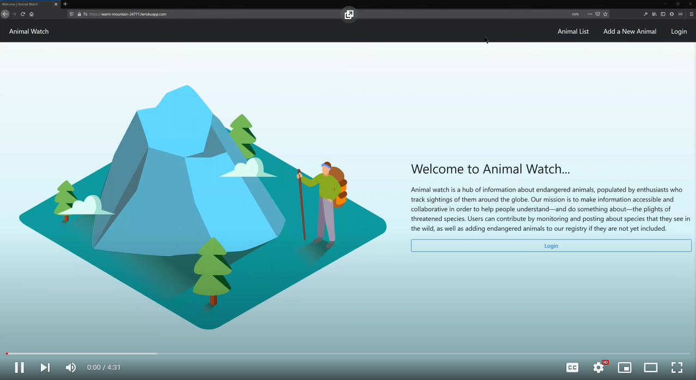
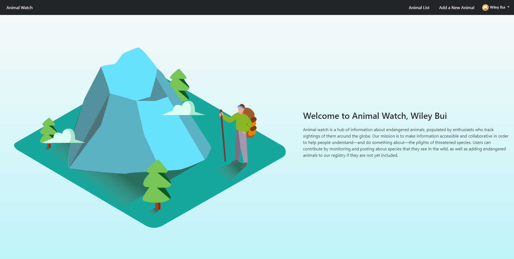
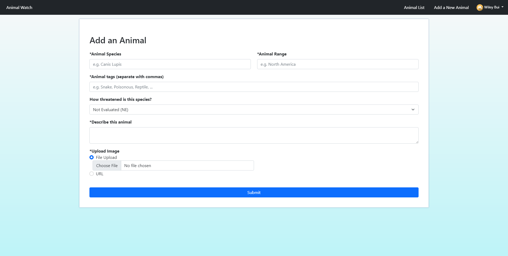
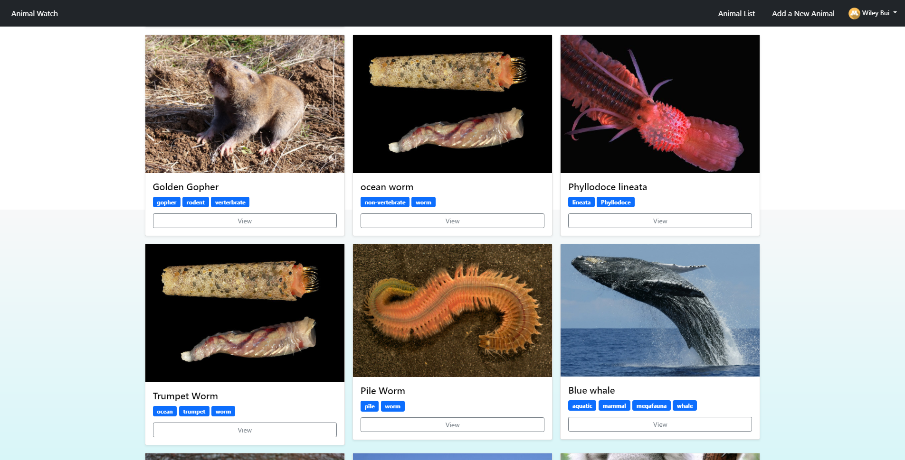
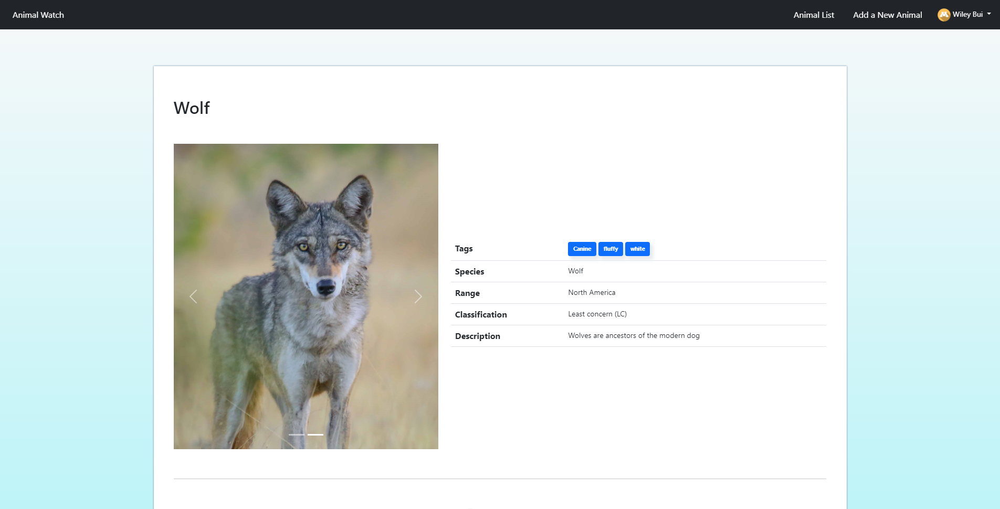
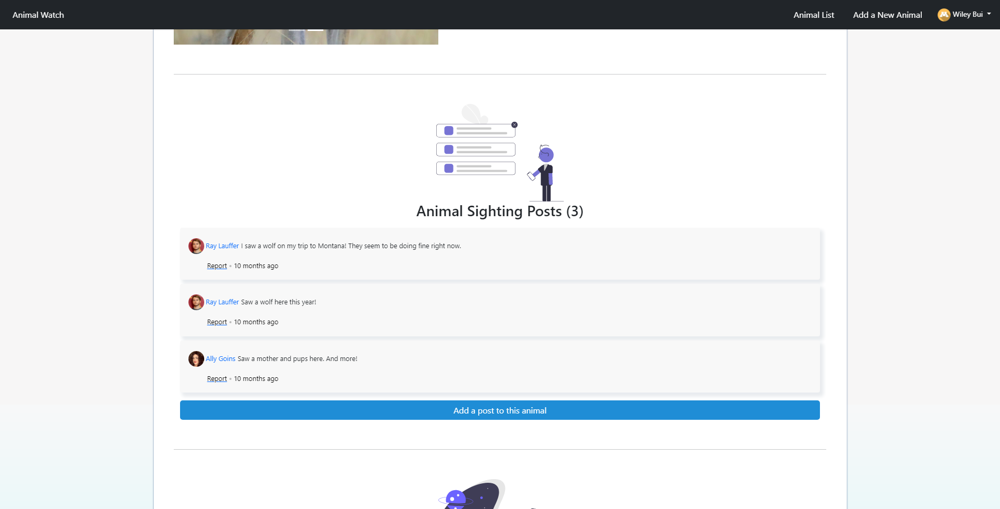
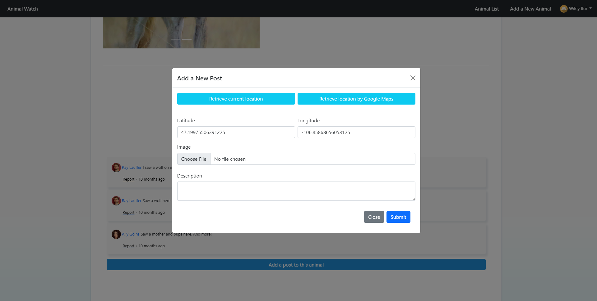
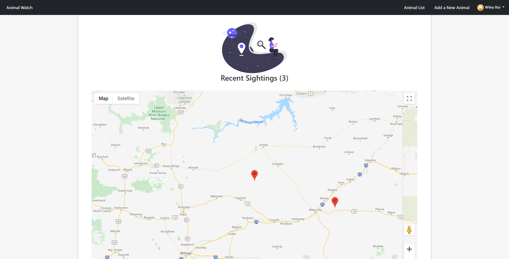
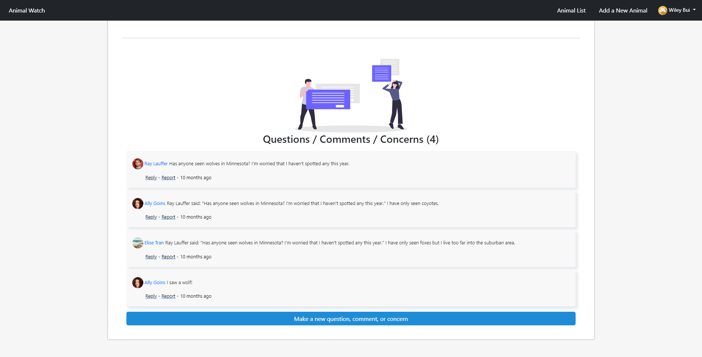

# Animal Watch

## App Info:

* Team Name: Free Labor
* App Name: Animal Watch
* App Link: https://warm-mountain-24771.herokuapp.com/

### Description
Animal Watch is a hub of information about endangered animals, populated by enthusiasts who track sightings of them around the globe. Our mission is to make information accessible and collaborative in order to help people understand—and do something about—the plights of threatened species. Users can contribute by monitoring and posting about species that they see in the wild, as well as adding endangered animals to our registry if they are not yet included.

### Authors

* Wiley Bui, buixx206@umn.edu
* Ally Goins, goin0004@umn.edu
* Ray Lauffer, lauff007@umn.edu
* Jakob Speert, speer034@umn.edu
* Elise Tran, tran0592@umn.edu

## Key Features

* Authorized users may choose to add to an existing animal post where they may able to retrieve the location by either their current location or somewhere else from Google Maps API.
* Users may choose to click on a tag of an animal post to filter all animals that have the same tag.
* Authorized user may add, edit, and remove their own post contents or question/answer contents as well as reply and report other people's contents.
* Reporting other people's contents will email the administrator.

## Video Demo of Site

## Screenshots of Site

### Welcome Page

The "Welcome" Page introduces our site's visitors to the web site they have entered. Users can have full access to the site by authenticating with their google user. This will allow them to post and comment.

### Add-an-Animal Page

The "Add-an-animal" Page allows users currently signed in to upload endangered animal encounters. The encounter (and, if applicable, user photo) will be listed with the animal's other information when selected from the "Animal-Feed" Page.

### Animal-Feed Page

This page is one of the core components of our web site: users will be presented with a grid of "Endangered Animal Tiles" with a photo of an endangered animal species and relevant tags beneath it (such as the animal type, location, and/or endangerment level). Upon clicking an animal tile, the current page redirects to another page with more detailed information about the animal (see screenshot below). These tiles will get more complex as more users add information/pictures for animal species because user information will get updated to each of the tiles to be seen by other users.

### Animal-Profile Page

This page is also one of the core components of our web site: users can see more information about the animal -- its tags, species, range, classification, description, post information, recent sightings, and allow users to comment on the post. Authorized user may edit, delete, and add new info to the post.

