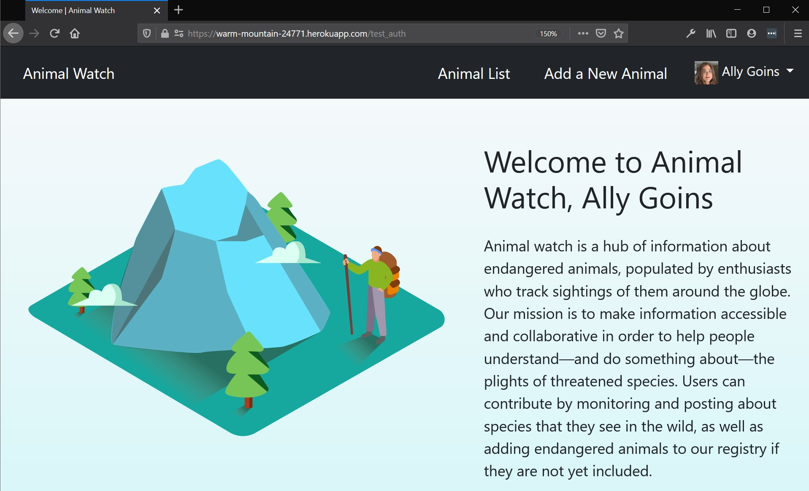
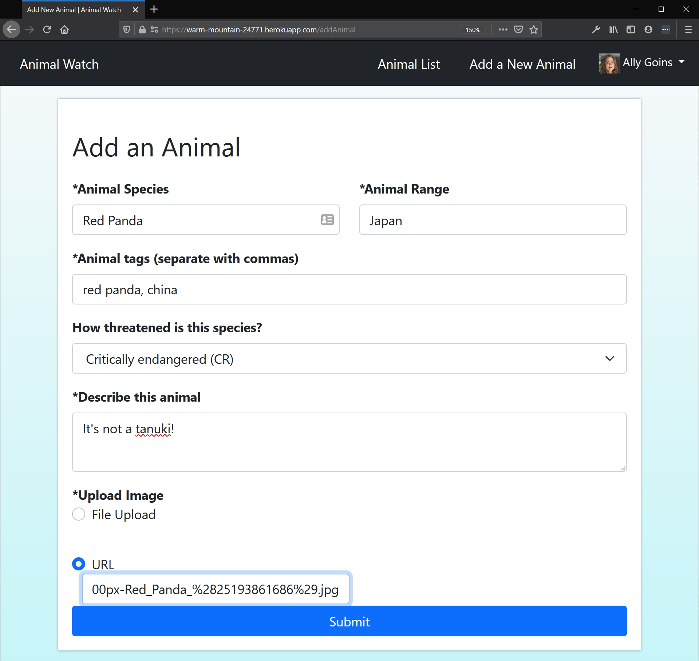
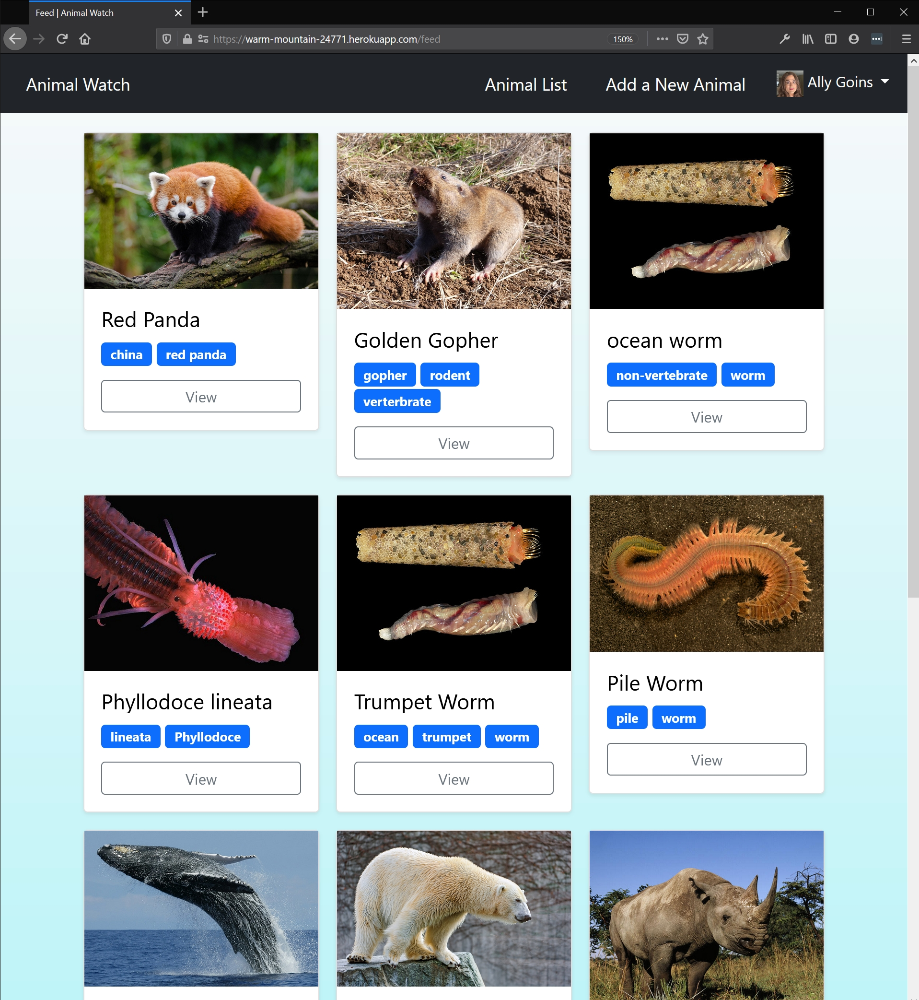
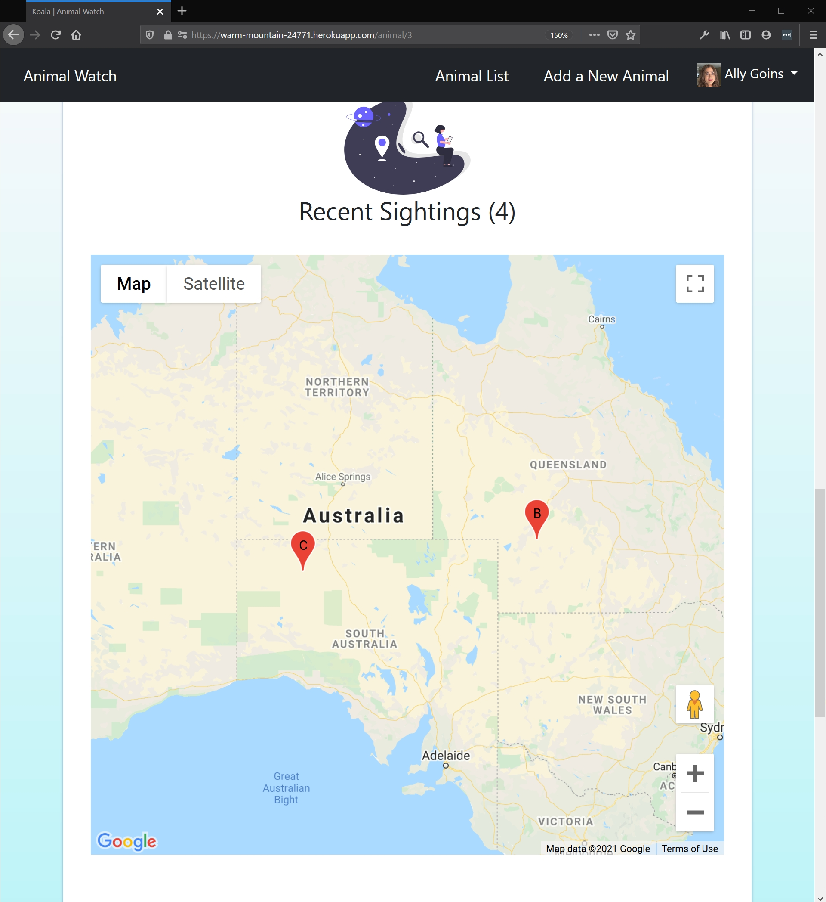

# Free Labor Group - Animal Watch

CSCI 5117, Spring 2021, [assignment description](https://canvas.umn.edu/courses/217951/pages/project-1)

## App Info:

* Team Name: Free Labor
* App Name: Animal Watch
* App Link: https://warm-mountain-24771.herokuapp.com/
* ****** USING **PYTHON 3.7+** unless there are strong objections/reasons to change ******

### Students

* Wiley Bui, buixx206@umn.edu
* Ally Goins, goin0004@umn.edu
* Ray Lauffer, lauff007@umn.edu
* Jakob Speert, speer034@umn.edu
* Elise Tran, tran0592@umn.edu

## Key Features

**Describe the most challenging features you implemented
(one sentence per bullet, maximum 4 bullets):**

* Authorized users may choose to add a post to an existing animal post where they may able to retrieve the location by either their current location or somewhere else from Google Maps API.
* Users may choose to click on a tag of an animal post to filter all animals that have the same tag.
* Authorized user may add, edit, and remove their own post contents or question/answer contents as well as reply and report other people's contents.
* Reporting other people's contents will email the administrator.

## Testing Notes

THE ADMIN EMAIL FOR OUR SITE IS animalwatch2021@gmail.com

You will need to add this line to your .env:
`MAIL_PASSWORD="xxxxxxxxxxxxx"`

Ask [Ally](goin0004@umn.edu) for password
************************
Run pipenv install after a pull from main!!!!!!!!!!!************
************************
**Is there anything special we need to know in order to effectively test your app? (optional):**

* ...

## Screenshots of Site

### Welcome Page

The "Welcome" Page introduces our site's visitors to the web site they have entered. If the user does not currently have an account, they should navigate to the sign-up page, where it collects user information that will allow them an identity when interacting with the site. Users should create an account with our application because it will allow them to make new posts/comments. 

### Add-an-Animal Page

The "Add-an-animal" Page allows users (that have already created an account and are currently signed in) to upload endangered animal encounters. If approved, the encounter (and, if applicable, user photo) will be listed with the animal's other information when selected from the "Animal-list" Page.

### Animal-Feed Page

This page is one of the core components of our web site: users will be presented with a grid of "Endangered Animal Tiles" with a photo of an endangered animal species and relevant tags beneath it (such as the animal type, location, and/or endangerment level). Upon clicking an animal tile, the current page redirects to another page with more detailed information about the animal (see screenshot below). A user may "favorite" the tile, if desired. These tiles will get more complex as more users add information/pictures for animal species because user information will get updated to each of the tiles to be seen by other users.

### Animal-Profile Page

This page is also one of the core components of our web site: users can see more information about the animal -- its tags, species, range, classification, description, post information, recent sightings, and allow users to comment on the post. Authorized user may edit, delete, and add new info to the post.

## External Dependencies

**Document integrations with 3rd Party code or services here.
Please do not document required libraries. or libraries that are mentioned in the product requirements**

* Library or service name: description of use
* ...

**If there's anything else you would like to disclose about how your project
relied on external code, expertise, or anything else, please disclose that
here:**

...
